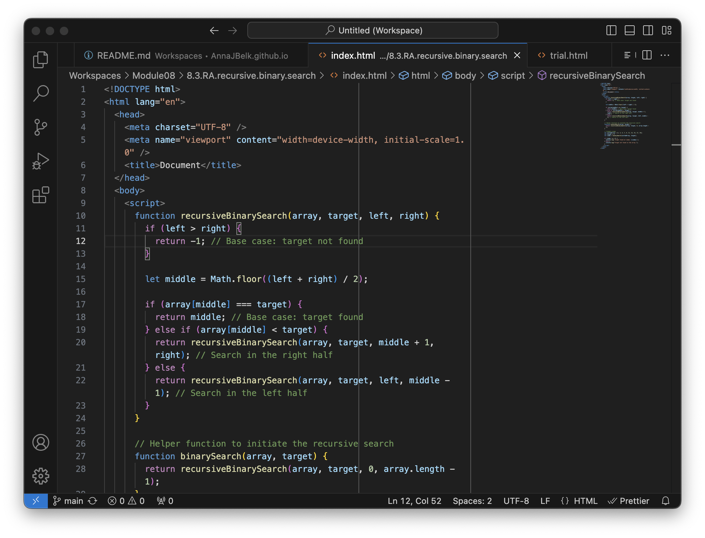

<h1 style="background-color: #d2ecfc; padding: 1px; border-radius: 10px">Project #01</h1>

  Lorem, ipsum dolor sit amet consectetur adipisicing elit. Exercitationem eos, obcaecati quia ad aspernatur consequatur facere dolor, explicabo, provident tempora accusantium nesciunt. Ipsum rerum unde labore, fugit numquam ullam cumque!

# Table of Contents

- [Introduction](#introduction)

- [Usage](#usage)

  - [Installation](#installation)

  - [Configuration](#configuration)

  - [Execution](#execution)

- [Documentation](#documentation)

- [License](#license)

- [Contributing](#contributing)

- [FAQ](#faq)

- [Badges](#badges)

## Introduction

## Usage

### Installation

### Configuration

### Execution

## Documentation

## License

## Contributing

## FAQ

## Badges
